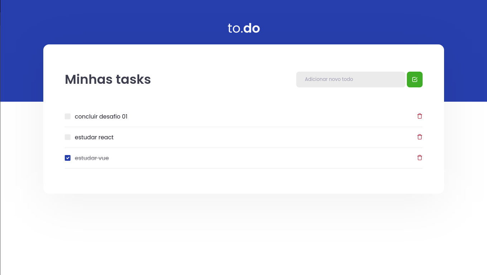
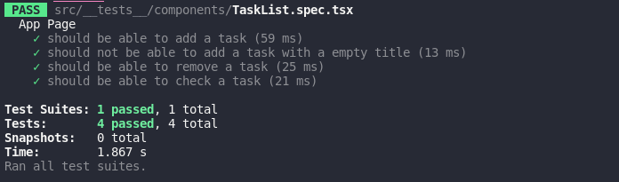

# 🚀 Ignite Conceito React - Desafio 01

Nesse desafio, você deverá criar uma aplicação para treinar o que aprendeu até agora no ReactJS

Essa será uma aplicação onde o seu principal objetivo é uma pequena aplicação de atividades a fazer, para treinar um pouco mais sobre manipulação do estado no React.

## Funcionalidades

- [x] Adicionar uma nova tarefa ✒️
- [x] Remover uma tarefa 🗑
- [x] Marcar e desmarcar uma tarefa como concluída ✅

## Excecutar local de desenvolvimento 🏠

Clone o projeto

```bash
  git clone https://github.com/pcbrsites/ignite-conceito-react
```

Vá para diretório do projeto

```bash
  cd ignite-conceito-react
```

Instale as dependências

```bash
  npm install
  # ou
  yarn install
```

Iniciar o servidor

```bash
  npm run dev
  # ou
  yarn run dev
```

### Rodar Teste

```bash
  npm run test
  # ou
  yarn run test
```



## License

[MIT](https://choosealicense.com/licenses/mit/)
